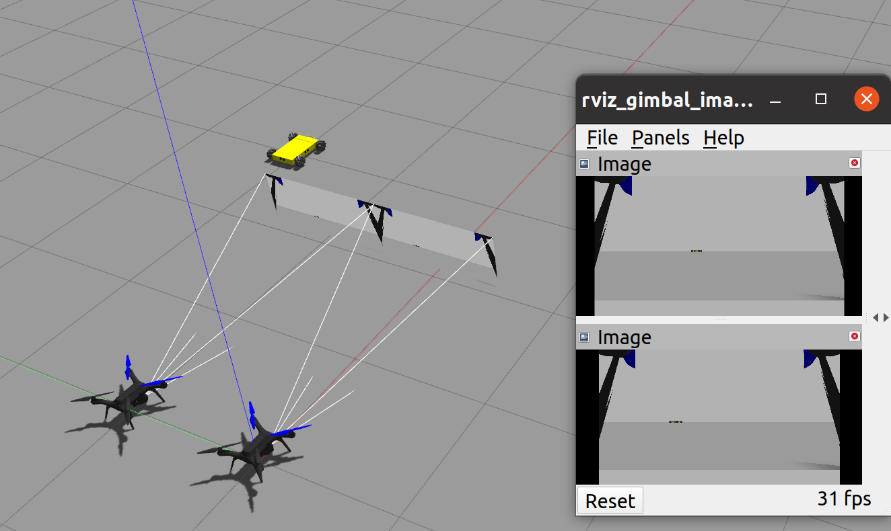

# UAVros

## Introduction

UAVros contains multiple ROS packages for PX4-gazebo simulation and experiment. Test has been made for the following PX4 drone version:

- v1.11.3
- v1.12.0-beta3
- v1.13.3
- v1.14 (under test)

Environment: ubuntu18.04 or ubuntu 20.04 with ROS1.

Several simulation examples are given in the form of ROS packages under the folder `uavros_simulation/`:

| ROS Module | PX4 version | Function|
| ------ | ----------- | ------- |
| [ARtagLanding_sitl](#uav-landing-on-ar-tag) | v1.11.3, v1.12.0-beta3, v1.13.3| Single UAV lands on an AR tag based on the visual servo using downward camera |
| [kcffollow_simulation](#uav-kcf-tracking-target) | v1.11.3, v1.12.0-beta3, v1.13.3  | Single UAV tracks AR tag using downward camera and KCF tracking algorithm |
| [uavros_uavugv_sitl](#multi-uav-formation-tracking-ugv) |  v1.11.3, v1.12.0-beta3, v1.13.3  | Two UAVs fly around the UGV in a spinning circle formation |
| [uavros_wrzf_sitl](#uav-tracking-gps-points-and-ugv) |  v1.11.3, v1.12.0-beta3, v1.13.3  | Single UAV tracks the preset GPS setpoints and moving UGV  based on the color detection using downward camera |
| [uavros_multi_gimbal_sitl](#multi-uav-with-gimbal-cameras) | v1.13.3, v1.14 | Multi-UAV with gimbal cameras cooperatively search and track targets |
| uavros_gazebo | > v1.11.3 | Gazebo simulation modules |

## Install

Install ROS1:

```bash
sudo sh -c '. /etc/lsb-release && echo "deb http://mirrors.ustc.edu.cn/ros/ubuntu/ `lsb_release -cs` main" > /etc/apt/sources.list.d/ros-latest.list'
wget https://gitee.com/shu-peixuan/px4mocap/blob/master/ROS-install-command/ros.key
sudo apt-key add ros.key
sudo apt-get update --fix-missing
sudo apt install ros-noetic-desktop # for ubuntu 20
echo "source /opt/ros/noetic/setup.bash" >> ~/.bashrc # for ubuntu 20
# sudo apt install ros-melodic-desktop # for ubuntu 18
# echo "source /opt/ros/melodic/setup.bash" >> ~/.bashrc # for ubuntu 18
```

Install mavros:

```bash
sudo apt install ros-noetic-mavros ros-noetic-mavros-extras # for ubuntu 20
# sudo apt install ros-melodic-mavros ros-melodic-mavros-extras  # for ubuntu 18
wget https://gitee.com/shu-peixuan/px4mocap/blob/master/ROS-install-command/install_geographiclib_datasets.sh
sudo chmod a+x ./install_geographiclib_datasets.sh
sudo ./install_geographiclib_datasets.sh # this step takes some time
```

Install PX4 Autopilot project:

```bash
cd ~
git clone https://github.com/PX4/PX4-Autopilot.git
cd PX4-Autopilot
git checkout v1.13.3 # or other version
git submodule update --init --recursive
bash Tools/setup/ubuntu.sh # This step takes some time. Make sure all dependencies are installed successfully!
# reboot the computer, then:
make px4_sitl gazebo

### if you use px4 version v1.13 or lower:
echo "
source ~/PX4-Autopilot/Tools/setup_gazebo.bash ~/PX4-Autopilot ~/PX4-Autopilot/build/px4_sitl_default
export ROS_PACKAGE_PATH=$ROS_PACKAGE_PATH:~/PX4-Autopilot
export ROS_PACKAGE_PATH=$ROS_PACKAGE_PATH:~/PX4-Autopilot/Tools/sitl_gazebo
" >> ~/.bashrc

### if you use px4 version v1.14:
echo "
source ~/PX4-Autopilot/Tools/simulation/gazebo-classic/setup_gazebo.bash ~/PX4-Autopilot ~/PX4-Autopilot/build/px4_sitl_default
export ROS_PACKAGE_PATH=$ROS_PACKAGE_PATH:~/PX4-Autopilot
export ROS_PACKAGE_PATH=$ROS_PACKAGE_PATH:~/PX4-Autopilot/Tools/simulation/gazebo-classic/sitl_gazebo-classic
" >> ~/.bashrc
```

Install dependencies:

```bash
sudo apt install xmlstarlet # generate multiple UAV sdf model

### for ROS melodic:
sudo apt install -y ros-melodic-ackermann-msgs ros-melodic-usb-cam ros-melodic-image-proc ros-melodic-image-pipeline ros-melodic-camera-calibration ros-melodic-effort-controllers ros-melodic-plotjuggler-ros ros-melodic-ar-track-alvar 

### for ROS noetic:
sudo apt install -y ros-noetic-ackermann-msgs # ackermann UGV control
sudo apt install -y ros-noetic-usb-cam  # usb camera
sudo apt install -y ros-noetic-image-proc # image calibrate
sudo apt install -y ros-noetic-image-pipeline # image compress and process
sudo apt install -y ros-noetic-camera-calibration # camera calibrate
sudo apt install -y ros-noetic-effort-controllers # racer model control
sudo apt install -y ros-noetic-plotjuggler-ros # curve plot and display
# sudo apt install -y ros-melodic-ar-track-alvar # AR tag detection
# ROS noetic apt does not have ar-track-alvar, compile the local folder instead.

### optional
sudo apt-get install llvm # install numba on X86 ubuntu for KCF tracking
pip install llvmlite # install numba on X86 ubuntu for KCF tracking
pip install numba # install numba on X86 ubuntu for KCF tracking
# For numba on ARM ubuntu, refer to https://blog.csdn.net/benchuspx/article/details/109152810
```

Clone and compile UAVros:

```bash
cd ~
git clone https://gitee.com/shu-peixuan/UAVros.git
cd UAVros/
./compile_all.sh
echo "source ~/UAVros/devel/setup.bash" >> ~/.bashrc
```


## Usage

### UAV landing on AR tag

1. Launch the sitl simulation:

    ```bash
    roslaunch uavros_artaglanding_sitl singleLanding_sitl.launch
    ```
    In rqt_image_view, choose image_raw topic.

2. Open QGroundControl. Click the left-top Q logo -> Vehicle Setup -> Parameters -> search "**COM_RCL_EXCEPT**" and change it to **7**. Otherwise the UAV will activate failsafe return mode as there is no manual remote controller input in simulation (bug in px4 1.13.3).

3. In QGroundControl, click "Ready To Fly" -> **Arm** -> Slide the bottom bar to confirm arming. Then click the top mode text and switch into "**offboard**" mode. Then the drone will takeoff.

4. Begin tracking and landing:

   ```bash
   rostopic pub /uav0/command std_msgs/Int32 "data: 1"
   ```

A landing service is also provided in `landing_service.cpp` for UAV that is in offboard mode and suitable height to call to land. This service is used in `uavrover_sitl.launch`  of "Multi-UAV formation tracking UGV".


### UAV KCF tracking target

1. Launch the sitl simulation:

    ```bash
    roslaunch uavros_kcffollow_simulation KCF_track.launch
    ```

2. Open QGroundControl. Click the left-top Q logo -> Vehicle Setup -> Parameters -> search "**COM_RCL_EXCEPT**" and change it to **7**. Otherwise the UAV will activate failsafe return mode as there is no manual remote controller input in simulation (bug in px4 1.13.3).

3. In QGroundControl, click "Ready To Fly" -> **Arm** -> Slide the bottom bar to confirm arming. Then click the top mode text and switch into "**offboard**" mode. Then the drone will takeoff. Or you can use the terminal keyboard to send 0 (arm) and 2 (takeoff).

4. Select the ROI area in the tracking window, then the UAV will begin tracking the target ROI.


### Multi-UAV formation tracking UGV

1. Launch the sitl simulation:

    ```bash
    roslaunch uavros_uavugv_sitl uavugv_sitl.launch # (two drones and one racecar)
    roslaunch uavros_uavugv_sitl uavrover_sitl.launch # (two drones and one rover)
    roslaunch uavros_uavugv_sitl uavrover_valley_sitl.launch # (two drones and one rover in valley)
    ```
    In rqt_image_view, choose image_raw topic of UAVs.

2. Open QGroundControl. Click the left-top Q logo -> Vehicle Setup -> Parameters -> search "**COM_RCL_EXCEPT**" and change it to **7**. **Do this for every UAV!** Otherwise the UAV will activate failsafe return mode as there is no manual remote controller input in simulation (bug in px4 1.13.3).

3. In QGroundControl, click "Ready To Fly" -> **Arm** -> Slide the bottom bar to confirm arming. Then click the top mode text and switch into "**offboard**" mode. Repeat for each UAV. Then the drones will takeoff.

4. Begin tracking and AR tag detection (will stop, return and land on the UGV using the AR tag landing module):

   ```bash
   rostopic pub /cmd std_msgs/Int32 "data: 1" # begin formation
   rostopic pub /cmd std_msgs/Int32 "data: 0" # stop formation
   ```
   The rover UGV and UAVs simulation video: https://www.bilibili.com/video/BV1U44y1r7ey/


### UAV tracking GPS points and UGV

1. Launch the sitl simulation:

    ```bash
    roscd uavros_wrzf_sitl/launch/
    ./cam_track_sitl.sh
    ```

2. Open QGroundControl. Click the left-top Q logo -> Vehicle Setup -> Parameters -> search "**COM_RCL_EXCEPT**" and change it to **7**. **Do this for every UAV!** Otherwise the UAV will activate failsafe return mode as there is no manual remote controller input in simulation (bug in px4 1.13.3).

3. In QGroundControl, click "Ready To Fly" -> **Arm** -> Slide the bottom bar to confirm arming.

4. Takeoff -> Fly to the first GPS setpoint -> begin tracking (if lost target for a period, auto fly to the next GPS setpoint defined in `config/tracking_param_sitl.yaml`)

   ```bash
   rostopic pub /jc_cmd std_msgs/Int32 "data: 0" # UAV wait
   rostopic pub /jc_cmd std_msgs/Int32 "data: 1" # UAV takeoff
   rostopic pub /jc_cmd std_msgs/Int32 "data: 6" # UAV return
   ```

5. Move the UGV to see the tracking performance:

    ```bash
    rostopic pub /ugv0/cmd_vel geometry_msgs/Twist "linear:
      x: 1.0
      y: 1.0
      z: 0.0
    angular:
      x: 0.0
      y: 0.0
      z: 0.0" -r 10
    ```


### Multi UAV with gimbal cameras

To launch multi-UAV with gimbals, you need to use PX4 v1.14 (under test) or **PX4 v1.13.3 with the following modifications**:

```bash
# If not in px4 v1.13.3, then you should first:
cd ~/PX4-Autopilot
git checkout v1.13.3
git submodule update --init --recursive

# 1. Substitute the gazebo_gimbal_controller_plugin.cpp (a udp_gimbal_port_remote is added to distinguish between gimbals)
roscd uavros_gazebo
cp px4_modification/gazebo_gimbal_controller_plugin.cpp ~/PX4-Autopilot/Tools/sitl_gazebo/src/gazebo_gimbal_controller_plugin.cpp
# 2. Add airframes (8001_solo_gimbal with gimbal enabled)
cp -r px4_modification/airframes/* ~/PX4-Autopilot/ROMFS/px4fmu_common/init.d-posix/airframes/
# 3. Delete px4_sitl_default and remake
cd ~/PX4-Autopilot
rm -r build/px4_sitl_default/
make px4_sitl_default gazebo
```

Procedures:

1. Launch the sitl simulation:

    ```bash
    roslaunch uavros_multi_gimbal_sitl multi_gimbal_uav_ugv.launch
    ```
    
2. Open QGroundControl. Click the left-top Q logo -> Vehicle Setup -> Parameters -> search "**COM_RCL_EXCEPT**" and change it to **7**. **Do this for every UAV!** Otherwise the UAV will activate failsafe return mode as there is no manual remote controller input in simulation (bug in px4 1.13.3).

3. The states of the gimbals can be controlled and read by:

    ```bash
    # echo gimbal angle of uav0
    rostopic echo /uav0/amov_gimbal_ros/gimbal_state
    
    # gimbal angle control of uav0 (angle rate control is invalid):
    rostopic pub /uav0/amov_gimbal_ros/gimbal_control amov_gimbal_sdk_ros/GimbalControl "header:
      seq: 0
      stamp: {secs: 0, nsecs: 0}
      frame_id: ''
    mode: 2
    roll_angle: 0.0
    pitch_angle: 0.0
    yaw_angle: 60.0
    roll_rate: 0.0
    pitch_rate: 0.0
    yaw_rate: 0.0" -r 10
    
    # gimbal image of uav0
    rostopic hz /uav0/amov_gimbal_ros/gimbal_image
    ```
    The gimbal angle is limited by roll [-45,45], pitch [90, -30] and yaw [-60, 60] degrees, where the roll and pitch are controlled as imu angle and yaw as rotor angle.

4. You can use QGroundControl to arm and launch vehicle or your mavros scripts to control the UAV flight and gimbals.

5. Move the UGV to see the tracking performance:

    ```bash
    rostopic pub /ugv0/cmd_vel geometry_msgs/Twist "linear:
      x: 0.5
      y: 0.0
      z: 0.0
    angular:
      x: 0.1
      y: 0.0
      z: 0.0" -r 10
    ```


