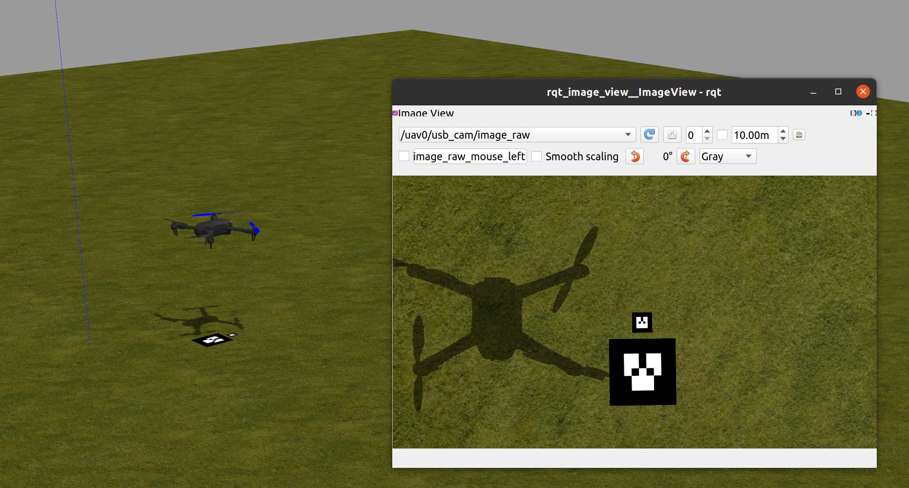
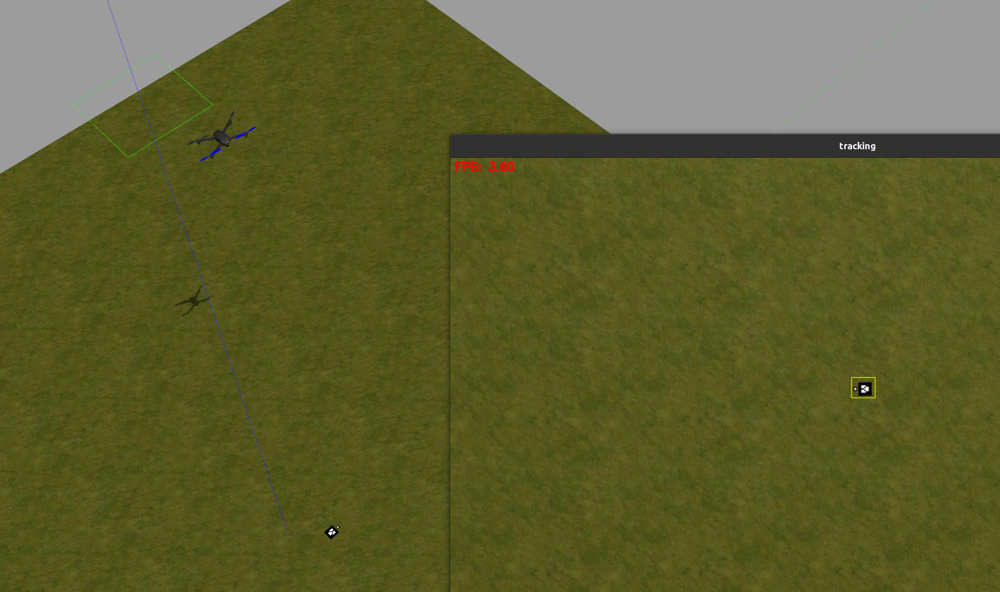
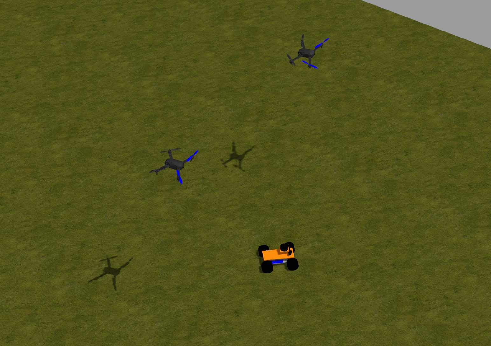
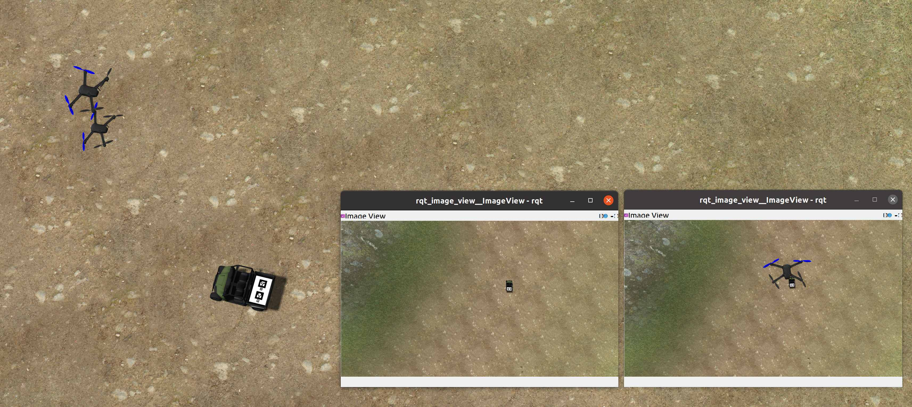
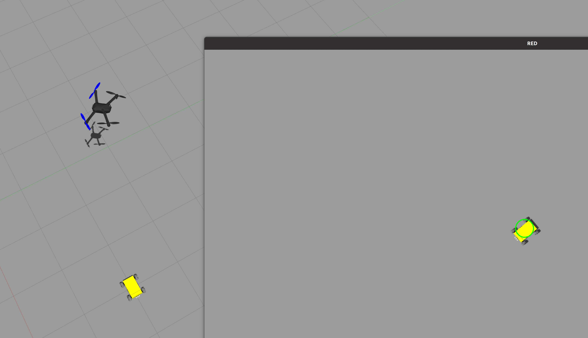

# UAVros

## Introduction

UAVros contains multiple ROS packages for PX4-gazebo simulation and experiment. Test has been made for the following PX4 drone version:

- v1.11.3
- v1.12.0-beta3
- v1.13.3 (under test)

Environment: ubuntu18.04 or ubuntu 20.04 with ROS1.

Several simulation examples are given in the form of ROS packages under the folder `uavros_simulation/`:

| Module | Function|
| ---| -------------------|
| ARtagLanding_sitl | Single UAV lands on an AR tag based on the visual servo using downward camera |
| kcffollow_simulation | Single UAV tracks AR tag using downward camera and KCF tracking algorithm |
| uavros_uavugv_sitl | Two UAVs fly around the UGV in a spinning circle formation |
| uavros_wrzf_sitl | Single UAV tracks the UGV based on the color detection using downward camera |
| uavros_gazebo | Gazebo simulation modules |

## Install

Install PX4:

```bash
# clone px4 and make
git clone https://github.com/PX4/PX4-Autopilot.git
cd PX4-Autopilot
git checkout v1.13.3 # or other version
git submodule update --init --recursive
bash Tools/setup/ubuntu.sh # make sure all dependencies are installed successfully!
# reboot the computer, then:
make px4_sitl gazebo

# add source path in .bashrc
echo "
source ~/PX4-Autopilot/Tools/setup_gazebo.bash ~/PX4-Autopilot ~/PX4-Autopilot/build/px4_sitl_default
export ROS_PACKAGE_PATH=$ROS_PACKAGE_PATH:~/PX4-Autopilot
export ROS_PACKAGE_PATH=$ROS_PACKAGE_PATH:~/PX4-Autopilot/Tools/sitl_gazebo
" >> ~/.bashrc
```

Install dependencies:

```bash
sudo apt install xmlstarlet # generate multiple UAV sdf model
# For numba on arm ubuntu, refer to https://blog.csdn.net/benchuspx/article/details/109152810
# install numba on x86 ubuntu:
sudo apt-get install llvm # for KCF tracking
pip install llvmlite # for KCF tracking
pip install numba # for KCF tracking

### ROS melodic:
sudo apt install ros-melodic-ar-track-alvar # AR tag detection
sudo apt install ros-melodic-ackermann-msgs # ackermann UGV control
sudo apt install ros-melodic-usb-cam  # usb camera
sudo apt install ros-melodic-image-proc # image calibrate
sudo apt install ros-melodic-image-pipeline # image compress and process
sudo apt install ros-melodic-camera-calibration # camera calibrate
sudo apt install ros-melodic-effort-controllers # racer model control
sudo apt install ros-melodic-plotjuggler-ros # curve plot and display
### ROS noetic:
# ROS noetic apt does not have ar-track-alvar, compile the local folder.
sudo apt install ros-noetic-ackermann-msgs # ackermann UGV control
sudo apt install ros-noetic-usb-cam # usb camera
sudo apt install ros-noetic-image-proc # image calibrate
sudo apt install ros-noetic-image-pipeline # image compress and process
sudo apt install ros-noetic-camera-calibration # camera calibrate
sudo apt install ros-noetic-effort-controllers # racer model control
sudo apt install ros-noetic-plotjuggler-ros # curve plot and display
```

Clone and compile UAVros:

```bash
git clone https://gitee.com/shu-peixuan/UAVros.git
cd UAVros/
./compile_all.sh
echo "source ~/UAVros/devel/setup.bash" >> ~/.bashrc
```


## Usage

### UAV landing on AR tag

1. Launch the sitl simulation:

    ```bash
    roslaunch uavros_artaglanding_sitl singleLanding_sitl.launch
    ```
    In rqt_image_view, choose image_raw topic.

2. Open QGroundControl. Click the left-top Q logo -> Vehicle Setup -> Parameters -> search "**COM_RCL_EXCEPT**" and change it to **7**. Otherwise the UAV will activate failsafe return mode as there is no manual remote controller input in simulation (bug in px4 1.13.3).

3. In QGroundControl, click "Ready To Fly" -> **Arm** -> Slide the bottom bar to confirm arming. Then click the top mode text and switch into "**offboard**" mode. Then the drone will takeoff.

4. Begin tracking and landing:

   ```bash
   rostopic pub /uav0/command std_msgs/Int32 "data: 1"
   ```

A landing service is also provided in `landing_service.cpp` for UAV that is in offboard mode and suitable height to call to land. This service is used in `uavrover_sitl.launch`  of "Multi-UAV formation tracking UGV".




### UAV KCF tracking target

1. Launch the sitl simulation:

    ```bash
    roslaunch uavros_kcffollow_simulation KCF_track.launch
    ```

2. Open QGroundControl. Click the left-top Q logo -> Vehicle Setup -> Parameters -> search "**COM_RCL_EXCEPT**" and change it to **7**. Otherwise the UAV will activate failsafe return mode as there is no manual remote controller input in simulation (bug in px4 1.13.3).

3. In QGroundControl, click "Ready To Fly" -> **Arm** -> Slide the bottom bar to confirm arming. Then click the top mode text and switch into "**offboard**" mode. Then the drone will takeoff. Or you can use the terminal keyboard to send 0 (arm) and 2 (takeoff).

4. Select the ROI area in the tracking window, then the UAV will begin tracking the target ROI.




### Multi-UAV formation tracking UGV

1. Launch the sitl simulation:

    ```bash
    roslaunch uavros_uavugv_sitl uavugv_sitl.launch # (two drones and one racecar)
    roslaunch uavros_uavugv_sitl uavrover_sitl.launch # (two drones and one rover)
    roslaunch uavros_uavugv_sitl uavrover_valley_sitl.launch # (two drones and one rover in valley)
    ```
    In rqt_image_view, choose image_raw topic of UAVs.

2. Open QGroundControl. Click the left-top Q logo -> Vehicle Setup -> Parameters -> search "**COM_RCL_EXCEPT**" and change it to **7**. **Do this for every UAV!** Otherwise the UAV will activate failsafe return mode as there is no manual remote controller input in simulation (bug in px4 1.13.3).

3. In QGroundControl, click "Ready To Fly" -> **Arm** -> Slide the bottom bar to confirm arming. Then click the top mode text and switch into "**offboard**" mode. Repeat for each UAV. Then the drones will takeoff.

4. Begin tracking and AR tag detection (will stop, return and land on the UGV using the AR tag landing module):

   ```bash
   rostopic pub /cmd std_msgs/Int32 "data: 1" # begin formation
   rostopic pub /cmd std_msgs/Int32 "data: 0" # stop formation
   ```
   The rover UGV and UAVs simulation video: https://www.bilibili.com/video/BV1U44y1r7ey/






### UAV tracking GPS points and UGV

1. Launch the sitl simulation:

    ```bash
    roscd uavros_wrzf_sitl/launch/
    ./cam_track_sitl.sh
    ```

2. Open QGroundControl. Click the left-top Q logo -> Vehicle Setup -> Parameters -> search "**COM_RCL_EXCEPT**" and change it to **7**. **Do this for every UAV!** Otherwise the UAV will activate failsafe return mode as there is no manual remote controller input in simulation (bug in px4 1.13.3).

3. In QGroundControl, click "Ready To Fly" -> **Arm** -> Slide the bottom bar to confirm arming.

4. Takeoff -> Fly to the first GPS setpoint -> begin tracking (if lost target for a period, auto fly to the next GPS setpoint defined in `config/tracking_param_sitl.yaml`)

   ```bash
   rostopic pub /jc_cmd std_msgs/Int32 "data: 0" # UAV wait
   rostopic pub /jc_cmd std_msgs/Int32 "data: 1" # UAV takeoff
   rostopic pub /jc_cmd std_msgs/Int32 "data: 6" # UAV return
   ```

5. Move the UGV to see the tracking performance:

    ```bash
    rostopic pub /ugv0/cmd_vel geometry_msgs/Twist "linear:
      x: 1.0
      y: 1.0
      z: 0.0
    angular:
      x: 0.0
      y: 0.0
      z: 0.0" -r 10
    ```

